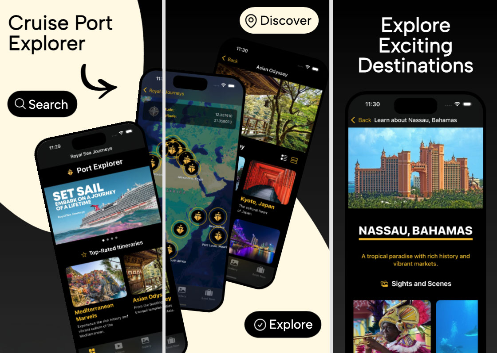
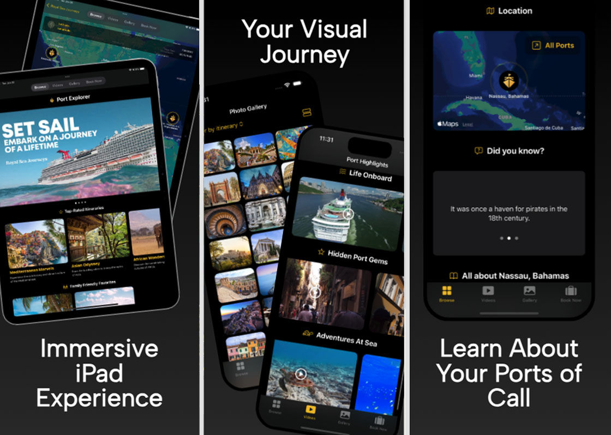

# 🌊 **Royal Sea Journeys: Port Explorer**  

**Royal Sea Journeys: Port Explorer** is a fully-featured iOS application designed to bring the ultimate cruise itinerary to life. With a stunning user interface, Port Explorer harnesses the power of **MapKit** and external APIs to deliver dynamic travel content. Whether you're discovering unique shore excursions, exploring breathtaking ports of call, or planning your next adventure, this app is your ultimate digital companion for all things cruising.

## Screenshots
|   |   |
| ------------- | ------------- |
|  |  |

## Demo
| iPhone | iPad |
| ------------- | ------------- |
|  |  |

## **Key Features**

### 🗺 **Interactive Map Explorer**  
- Powered by **MapKit**, users can:
  - Navigate a world map to discover ports of call for various itineraries.  
  - Tap on interactive **map annotations** to explore detailed port information.
  - View real-time latitude and longitude coordinates via a sleek overlay.

### 📅 **API Provided Itinerary Highlights**  
- **Integrates with a travel API** to fetch itinerary and port data, and displays itineraries with carousel and grid layouts.
- Drill down into itinerary details with seamless navigation to ports of call.
- Utilizes the **Kingfisher** SKD for optimized image caching and loading.

### 📹 **Dynamic Video Galleries**  
- Integrates with the **Pixabay Video API** to showcase dynamically loaded travel videos

### 📷 **Customizable Photo Gallery**  
- A polished, user-friendly interface that supports dynamic filtering, lazy loading for performance, and toggleable grid views.
- Images are fetched from the external travel API and cached with Kingfisher, ensuring modularity and scalability.  
### 📱 **iPad Support**  
- The app fully supports **iPadOS**, offering a rich and immersive experience on larger screens.  

## **Other Highlights**  

- **Modern Swift Practices**  
  - Leveraged **async/await** for API calls and data fetching.
  - Used `@MainActor` annotations to ensure thread-safe UI updates.

- **UI and User Experience**  
 
  - Implemented **accessibility features** for improved usability, including VoiceOver support.  

- **Modular and Scalable Code**  

  - Used **MVVM** for scalable data flow management.


## 🚀 **Built With**  

- Swift 5
- SwiftUI
- Xcode 16.2 

### Installation  
1. Clone the repository:  
   ```bash
   git clone https://github.com/your-username/RoyalSeaJourneys.git
